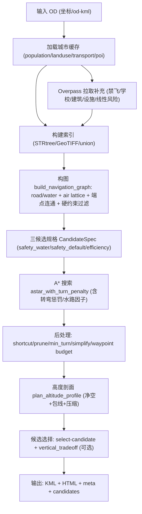

# `plan_auto_route.py`（最新版）航线规划算法说明（中文）

> 代码来源：`skills/plan-auto-route/scripts/plan_auto_route.py`  
> 版本标识：以脚本内 `ALGORITHM_VERSION` 常量为准（当前为 `plan-auto-route-latest-air-corridor-v4-refactor-landuse-softnofly-astarfix`）。

## 1. 背景与适用场景

该算法面向**城市无人机物流**的 OD（起点-终点）自动航线规划，特点是：

- **开源数据驱动**：以城市缓存数据 + Overpass/OSM 要素为主要输入来源。
- **风险感知搜索**：把“人口暴露、土地利用、关键设施、软禁飞、高楼/线性风险”等因素折算为路径代价，在图上进行 A* 搜索。
- **三套候选方案**：同时给出“安全优先（水路偏好）/安全优先（默认）/效率优先”3 条可视化候选。
- **高度剖面规划**：在选定的水平路径上，基于地形 + 建筑/障碍物顶面，生成满足净空与爬升/下降包线的高度曲线，并压缩成 KML 航点。

适用：规划评估、方案比选、风险评估工作流前置输入（例如输出给 `workflow_v2` 做分层复核）。  
不适用：直接用于真实运营合规放飞（开源数据完整性与禁飞覆盖需要另行核验，SORA/JARUS 等合规应作为独立 gate）。

### 1.1 一句话伪代码（端到端）

```text
inputs = OD(start,end) + city_cache + (optional DEM) + (optional open-data no-fly)
features = build_indices(population, landuse, infra, POI, buildings/obstacles, line-risk, school, no-fly)
graph = build_navigation_graph(road/water from cache+overpass, +oblique air lattice, +endpoint connectors, hard-filter)
candidates = solve 3 schemes via A* (risk-aware edge cost + turn penalty + optional water bias)
candidates = postprocess (shortcut/prune/turn-angle/simplify/waypoint budget)
candidates = altitude_profile_feasible? (clearance + envelope + caps) ; drop infeasible
selected = select-candidate else safety_default ; optionally switch by vertical_tradeoff
export KML/HTML/meta/candidates_json
```

---

## 2. 输入 / 输出与关键 CLI 参数

### 2.1 输入（OD）

- 直接给坐标：
  - `--start-lon --start-lat --end-lon --end-lat`
- 或从 KML 端点读取：
  - `--od-kml /absolute/path/to/route.kml`（取第一点为 start，最后一点为 end）

### 2.2 关键参数（常用）

- 风格/权重：
  - `--profile fastest|balanced|safest`（基础权重模板）
  - `--select-candidate safety_water|safety_default|efficiency`（最终输出选择哪条候选；默认 `safety_default`）
  - `--soft-no-fly-scale <float>`（软禁飞惩罚倍率：更小更偏效率、更大更保守）
- 开源禁飞：
  - `--open-data-no-fly`（启用机场/军用等 open-data 禁飞：硬/软分层）
- 飞行包线/净空：
  - `--clearance-m`（相对地形+建筑/障碍顶面净空）
  - `--min-true-height-m --max-true-height-m --endpoint-true-height-m`
  - `--preferred-cruise-max-m --hard-ceiling-m`
- 机体假设（影响转弯/爬升下降包线）：
  - `--speed-ms --climb-ms --descend-ms --turn-radius-m`
- 转弯/航点后处理：
  - `--min-turn-keep-deg`（低收益弯折裁剪阈值）
  - `--min-turn-angle-deg`（最终水平航线最小内角硬约束，默认 120°）
  - `--turn-prune-passes`（弯折裁剪轮数）
  - `--max-waypoints`（可选：后处理后水平航点硬上限；0 表示自动/不强制）
- 选线“垂向工作量”权衡（默认开启）：
  - `--vertical-tradeoff / --no-vertical-tradeoff`
  - `--vertical-detour-limit-ratio`（允许为换取垂向工作量降低而绕行的最大距离比）
  - `--vertical-improve-ratio`（垂向工作量至少降低多少比例才允许切换）
  - `--vertical-energy-weight`（距离 vs 垂向工作量的权衡权重）
- 地形数据：
  - `--dem-tif <GeoTIFF>`（推荐：本地 DEM）
  - `--opentopo-endpoint <url>`（无 DEM 时使用 OpenTopoData SRTM 接口）

### 2.3 输出

默认输出目录 `output/auto_routes/`：

- `<name>.kml`：最终航线（`altitudeMode=absolute`，含高度）
- `<name>.html`：预览地图（含 3 条候选可切换图层）
- `<name>_meta.json`：主航线 meta（图/代价/约束/高度剖面统计）
- `<name>_candidates.json`：候选汇总（每条候选的距离、绕行、水路占比、buffer 指标、垂向能耗代理等）
- `<name>_pareto.json`：Pareto 前沿摘要（距离/人口 p90/垂向工作量）
- `<name>_evidence.json`：结构化证据包（约束检查、目标向量、覆盖度、选择链路）
- `snapshots/<name>_snapshot.json`：运行快照（参数、输入来源、环境、输出路径）

可选：`--run-workflow-v2` 输出 `output/full-workflow-v2-auto-route/<name>/<name>_map.html` 做分层复核。

---

## 3. 数据依赖清单（本地缓存 + Overpass + 栅格）

### 3.1 城市缓存（必须）

来自 `output/city_data_cache/<city>/download_summary.json` 指向的产物，主要包括：

- **人口栅格**：`population/clipped_tif`（GeoTIFF；GDAL 读取，用于人口密度采样）
- **土地利用**：`landuse/geojson`（Polygon/MultiPolygon；映射到 landuse 风险成本）
- **交通网络**：`transport/roads_geojson`（道路）+ 其他交通图层（如高铁）
- **POI**：`poi/...`（用于 crowd/key facility 的点风险）

### 3.2 Overpass（按规划范围 bbox 拉取，可能被缓存）

用于补齐/动态获取：

- 开放数据禁飞：机场/直升机场/军用区（硬/软）
- 学校/幼儿园：并加入“学校硬缓冲区”
- 建筑与障碍：building、多种塔桅/电力设施等（高度代理、避让区）
- 关键基础设施：电力/塔桅等（惩罚/硬缓冲）
- 线性风险：高速/主干路、高铁等（`line_cross` 重叠惩罚）

### 3.3 DEM（地形）

- 优先本地 `--dem-tif`（GeoTIFF；采样地形高程）
- 否则使用 OpenTopoData SRTM（网络接口，精度/稳定性依赖外部服务）

---

## 4. 图构建：road / water / air（含“斜向自由空域网格”）

核心入口：`build_navigation_graph(...)`。

### 4.1 图节点与边

- 节点：对坐标进行栅格化/吸附（`GRAPH_NODE_SNAP_M`）以合并相近点，降低图规模与抖动。
- 边来源：
  1. 道路边（road）
  2. 水系边（water）
  3. **空域边（air lattice）**：围绕 start→end 方向建立带偏移的斜向网格（`AIR_LATTICE_STEP_M / MARGIN / MAX_OFFSET`），提供“直线穿越低风险走廊”的可行性。

### 4.2 端点连通

为 start/end 追加连接边，确保可进入：

- 空域网格（优先建立多条 air 连接）
- 通用节点集（air 连接到附近节点）
-（可选）水系网络：允许端点“跳入水路”以形成水路偏好候选

若端点在指定半径内无法连到图，则认为不可行（直接抛错）。

### 4.3 硬约束过滤（在“加边”阶段直接剔除不可行边）

边在加入图前会先进行“是否与硬约束相交”的判断：

- **硬禁飞区**（open-data no-fly hard union）
- **硬基础设施缓冲**（可选：对高严重度设施加 buffer 并 union）
- **学校硬缓冲区**（并对端点周边做 relief，允许起降附近更可行）

硬约束的特点：**不可穿越**，否则边直接不入图（可行性优先于优化）。

---

## 5. 风险代价函数：每条边的“每米成本 × 距离”

代价计算入口：`edge_meta_for_segment(...)`（在 `build_navigation_graph` 内）。

### 5.1 多点采样（避免只看端点）

对每条边（线段）按长度选择若干采样比例点（短边 3 点，长边更多点），在采样点上计算：

- 人口密度（GeoTIFF）
- 土地利用成本（Polygon cost）
- 基础设施惩罚（距离/缓冲）
- 建筑/障碍物高度代理（intersection/nearest）
- POI 点风险（crowd / key facility）

再结合线段与若干 union 区的**重叠比例**：

- 软禁飞 overlap
- 线性风险 overlap（高速/高铁缓冲）
- 高楼避让区 overlap
- 学校硬缓冲 overlap（并参与额外惩罚项）

### 5.2 成本项总览（权重入口与含义）

最终边成本大致形态为：

`edge_base_cost = dist_m * per_m_cost`

其中 `per_m_cost` 由下列项加权组合（并按 network_type 做倍率修正）：

| 项名（weights key） | 数据来源 | 计算形态（概念） | 作用直觉 |
|---|---|---|---|
| `length` | 几何 | 常量项 | 更短更好 |
| `population` | 人口栅格 | `pop_norm`（avg/p90/peak 混合后归一） | 避开人群密集区 |
| `landuse` | landuse GeoJSON | `_landuse_cost(landuse_type)` 的采样平均 | 偏好水面/绿地，惩罚住宅/商用等 |
| `infrastructure` | 高铁/电力/塔桅等 | 距离分段惩罚 + 统计分位 | 避开关键基础设施 |
| `altitude` | 建筑/障碍 | `height_proxy`（采样混合） | 避开高楼/高障碍密集区（降低高度压力） |
| `soft_no_fly` | open-data no-fly | overlap ratio | 尽量远离软禁飞 |
| `crowd` | crowd POI | 点风险惩罚（inner/buffer 分段） | 避开学校/医院/商圈等 |
| `key_facility` | 政府/警消等 | 点风险惩罚 | 避开敏感设施 |
| `line_cross` | 高速/高铁缓冲 | overlap ratio | 降低线性风险区穿越 |
| `high_building` | 高楼 union | overlap ratio | 更强避开高楼密集区 |
| `school_penalty_*` | 学校缓冲 | overlap ratio ×（air/ground 不同系数） | 对学校区域更强惩罚 |
| `turn` | 搜索阶段 | 由 `_turn_penalty_for_vectors` 注入 | 减少急弯与小半径弯 |

> 备注：`WEIGHT_PROFILES` 提供 `fastest/balanced/safest` 三套基础权重；每个候选方案还会用 `CandidateSpec.weight_scale` 做二次缩放。

### 5.3 网络类型倍率（road / water / air）

边成本会根据 `network_type` 使用不同倍率与上下文修正（例如道路在人口极密处可能上调、空域在低密与低风险 landuse 场景下可能下调），其效果是：**同样距离在不同通道类型上“风险单价”不同**。

---

## 6. A* 搜索与转弯惩罚模型

核心入口：`astar_with_turn_penalty(...)`。

### 6.1 搜索状态带“上一节点”

为了把转弯惩罚加入路径代价，A* 的状态不是“当前节点”，而是 `(prev_node, cur_node)`：

- 这样在扩展到 `next_node` 时可得到两段向量 `prev_vec` 与 `next_vec`，进而计算转弯代价。

### 6.2 转弯惩罚 `_turn_penalty_for_vectors(...)`

转弯惩罚由以下因素构成：

- **转向角**：小于 `TURN_IGNORE_DEG` 的微小折线忽略；大角度按 severity 非线性放大。
- **半径代理**：用 “边长 / 角度弧度” 近似弯曲半径，与 `turn_radius_m` 做对比给出惩罚。
- **路网类型加权**：road 上的转弯惩罚更强（抑制沿道路频繁转弯）。
- **可行性裁剪**：可设置 `max_turn_deflection_deg`，超过则认为该转弯不可行（直接剪枝）。

### 6.3 水路偏好 `_water_step_factor(...)`

当 `network_type == water` 时，对边的 base 成本乘以一个因子：

- `water_pref_factor` 越小，水路越“便宜”（越偏好水路）
- 在人口更密集（`pop_p90` 更高）时，对水路给予更大的相对奖励（降低因子），强化“密集区沿水更安全”的倾向

---

## 7. 三套候选方案与选择逻辑（权衡显式化）

候选规格由 `CandidateSpec` 列表定义，固定输出三条：

1. `safety_water`：安全优先 + 水路偏好（在满足一定 detour 限制与水路占比门限时更愿意走水系）
2. `safety_default`：默认安全优先（主输出默认选择）
3. `efficiency`：效率优先（权重显著偏距离/速度）

每条候选的差异来自：

- 基础 `profile_key`（`fastest` 或 `safest`）
- `weight_scale`（对各风险项的二次缩放）
- 水路相关：是否允许水路连通、`water_pref_factor`、`water_detour_limit`、`min_water_share`
- 学校惩罚强度：`school_penalty_air/ground`
- 可选扫点：`--weight-sweep-levels` 会在 `safety_default` 与 `efficiency` 之间插值生成额外候选，并参与求解。

### 7.0 候选方案参数一览（与代码保持一致）

| 候选 ID | 标签 | `profile_key` | 水路连接 | `water_pref_factor` | 允许水路选择 | `water_detour_limit` | `min_water_share` | 学校惩罚（air/ground） |
|---|---|---|---:|---:|---:|---:|---:|---:|
| `safety_water` | 安全优先 + 水路偏好 | `safest` | 视 `long_water_available` | `0.5` | 是 | `2.0`（长水系可用时）否则 `1.18` | `0.2` | `14.0 / 10.5` |
| `safety_default` | 安全优先（默认） | `safest` | 否 | `0.72` | 是 | `1.18` | `0.08` | `11.0 / 8.0` |
| `efficiency` | 效率优先 | `fastest` | 否 | `1.0` | 否 | `1.35` | `0.0` | `5.0 / 3.8` |

### 7.1 选线：`--select-candidate` 与默认兜底

- 若命中指定候选 ID：直接选
- 否则优先回落到 `safety_default`
- 再不行：选第一个可行候选（保底）

### 7.2 Pareto 前沿与可选切换

- 使用指标：`distance_km`、`path_population_p90`、`vertical_energy_proxy_m`（均越小越优）。
- 前沿构造：删除被其他候选“全维不差且至少一维更优”的解，输出到 `<name>_pareto.json`。
- 可选切换：`--pareto-select` 开启后，在 detour 限制内按加权分数选前沿解：
  - `distance_weight * dist_ratio + population_weight * pop_ratio + energy_weight * energy_ratio`
  - 权重来源优先级：内置默认 -> 策略文件基础策略 -> 业务线/城市/profile 覆盖 -> CLI 显式覆盖。
- 策略文件默认路径：`skills/plan-auto-route/config/pareto_policies.json`，可通过 `--pareto-policy-file` 替换。
- 内置模板（可直接使用）：
  - `urban_dense`：人口风险优先，绕行上限更紧（适合核心城区配送）
  - `suburban_logistics`：效率优先，允许更大绕行窗口（适合郊区物流走廊）
- 策略选择参数：
  - `--pareto-policy-name`
  - `--pareto-business-line`
  - `--pareto-detour-limit-ratio --pareto-distance-weight --pareto-pop-weight --pareto-energy-weight`（可选显式覆盖）

### 7.3 垂向工作量权衡（`vertical_tradeoff`）

在多条候选都能通过高度剖面可行性检查后，可在“允许绕行”范围内，用**垂向能耗代理**（`vertical_energy_proxy_m = climb + 0.65*descent`）换取更易飞的高度曲线：

- 候选距离比不超过 `vertical_detour_limit_ratio`
- 垂向工作量至少改善 `vertical_improve_ratio`
- 用 `dist_ratio + vertical_energy_weight * energy_ratio` 做最终比较

---

## 8. 后处理：水平航线清理与航点控制

后处理目标：在不破坏硬约束与关键风险目标的前提下，减少“锯齿”和“低收益弯折”，并满足最小转角约束。

主要步骤（对每条候选路线执行）：

1. `shortcut_polyline(...)`：尝试用直连替换局部折线路段，但必须通过 `_is_shortcut_safe(...)`：
   - 不得穿越硬约束（硬禁飞/硬设施/学校硬缓冲）
   - 直连段的人口 p90/avg 不得显著高于原段（阈值为比例 + 常数）
2. `prune_low_value_turns(...)`：对角度小于 `min_turn_keep_deg` 的“低收益弯折”进行裁剪，但同样要求安全捷径检查通过。
3. `enforce_min_turn_angle(...)`：确保最终水平航线最小内角 ≥ `min_turn_angle_deg`（急锐角直接不可接受）。
4. `simplify_polyline(...)`：几何简化（容差）并再次检查转角约束。
5. `enforce_waypoint_budget(...)`（可选）：若 `--max-waypoints > 2`，对水平航点做硬上限控制；裁剪过程仍需通过安全捷径检查。

---

## 9. 高度剖面规划：净空 + 包线 + 航点压缩

核心入口：`plan_altitude_profile(...)`。

### 9.1 采样与下界（`z_min`）

- 按 `ALT_PROFILE_SPACING_M`（默认 25m）对水平路径采样
- 对每个采样点：
  - 采样地形高程（DEM 或 OpenTopoData）
  - 查询建筑高度（点在 polygon 内取最大）
  - 查询障碍物高度（附近最近）
  - 顶面 = terrain + max(building, obstacle)
  - `z_min = 顶面 + clearance_m`

### 9.2 高度上界（软帽/硬帽）与真高约束

- 真高（AGL）目标区间：`min_true_height_m .. max_true_height_m`
- endpoint 附近可使用 `endpoint_true_height_m` 形成起降过渡（脚本内有短距离 ramp 思路）
- 偏好巡航软帽：`preferred_cruise_max_m`（允许小幅 relax）
- 硬帽：`hard_ceiling_m`（不可超越）

### 9.3 爬升/下降包线

由 `speed_ms/climb_ms/descend_ms` 推出“单位水平距离允许的爬升/下降比例”，用于检查任意两点间的线性插值是否可行（防止高度曲线出现过陡变化）。

### 9.4 航点压缩（KML 点数控制）

`compress_altitude_waypoints(...)` 在满足：

- `z` 不低于 `z_min`
- 不超过硬帽
- 插值误差不超过 `ALT_PROFILE_LINK_ERR_TOL_M`
- 且爬升/下降包线可行

的前提下，尽可能用更少的高度航点表达整条剖面（保留端点与必要点）。

---

## 10. 评估指标：如何读 `_meta.json` 与 `_candidates.json`

建议把指标分成四类：

1. **效率类**：距离（km）、绕行比（vs 直线）、航点数（水平/高度）
2. **风险暴露类**：人口暴露（通过边采样隐含进入 cost；可用 buffer 指标辅助对比）
3. **可飞性类**：转弯次数、最小转角、垂向能耗代理、总爬升/下降、最大真高、最小净空
4. **环境/约束类**：软禁飞 overlap、线性风险 overlap、高楼 overlap、buffer 内 crowd/key/infra 数量

候选汇总（`_candidates.json`）里通常会直接给出：

- `distance_km`, `detour_ratio_vs_direct`, `water_share`
- `turns_after_post_smooth`, `min_turn_angle_deg`
- `vertical_energy_proxy_m`, `total_climb_m`, `total_descent_m`, `max_true_height_m`
- `buffer_metrics`（crowd/key/infra 计数、line/high_build overlap）
- `route_selection_strategy`（可能包含 `+vertical_tradeoff`）

---

## 11. 已知限制与风险提示（必须读）

- **OSM/Overpass 完整性**：禁飞/建筑高度/POI 缺失会直接影响结果；算法只能对“看得见的数据”负责。
- **Overpass 抖动**：网络/服务波动会导致拉取不稳定；脚本有缓存机制但仍需复核关键要素。
- **DEM 精度**：OpenTopoData SRTM 分辨率有限；建议提供本地高精度 DEM（`--dem-tif`）。
- **高度并非空域合规**：高度剖面只基于地形/建筑/障碍净空与机体包线，不等价于法规空域许可。
- **硬约束依赖定义**：硬设施缓冲、学校硬缓冲的半径与逻辑是工程假设，需按项目要求校准。

---

## 12. 改进路线图（短 / 中 / 长期）

### 短期（工程鲁棒性）

- 固化所有外部数据版本（Overpass 结果落盘 + checksum），提升可复现性。
- 给 cost/约束输出“解释性报告”（边采样统计、主要贡献项 Top-N），便于审计。

### 中期（模型与搜索质量）

- 把“人群暴露”从点采样升级为**走廊面积积分**（buffer × 栅格积分），更稳定。
- 将风险项做**单位一致与标定**：从经验权重走向有数据的校准（例如用历史事件/地物密度拟合）。
- 引入多目标求解（Pareto 前沿）替代固定三候选，输出一组可选折中解。

### 长期（3D 与合规闭环）

- 把高度/空域约束前移到搜索阶段（真正 3D/4D 图搜索），避免“水平可行但垂向不可行”的浪费。
- 接入更权威的空域/禁飞数据源与动态信息（NOTAM/临时管制/活动区域）。
- 与 SORA/JARUS 等合规流程做结构化对接：将规划输出直接映射到风险评估输入与审计证据链。

---

## Mermaid：端到端流程图


